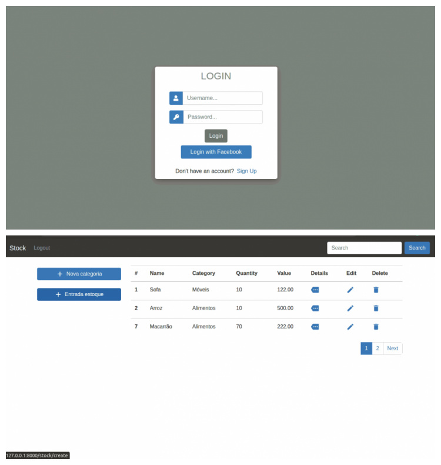
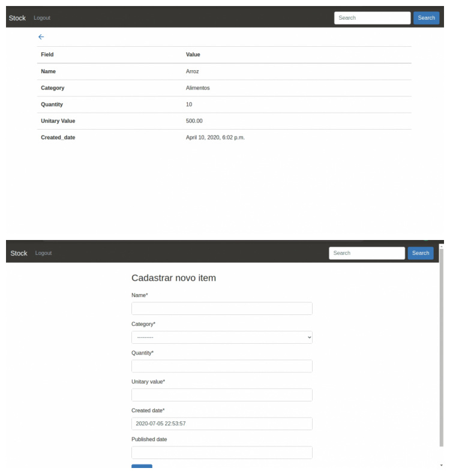

<h2 align="center">
	Controle de estoque
	<br>
</h2>

Sistema com autenticação para adicionar produtos e categorias ao estoque, com intuito de melhorar a gestão.

<h1 align="center">
    
    
</h1>

## Execução 💻

> Ativando ambiente virtual
```
> source venv/bin/activate
```
> Rodando o projeto
```
> python3 manage.py runserver
```
## Tecnologias usadas 🛠

- Back-end:
	- Django REST
  - SQLite
  - Django 
- Front-end:
	- HTML
	- CSS
  - JavaScript
  - Bootstrap
